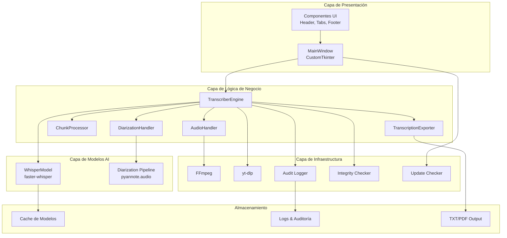
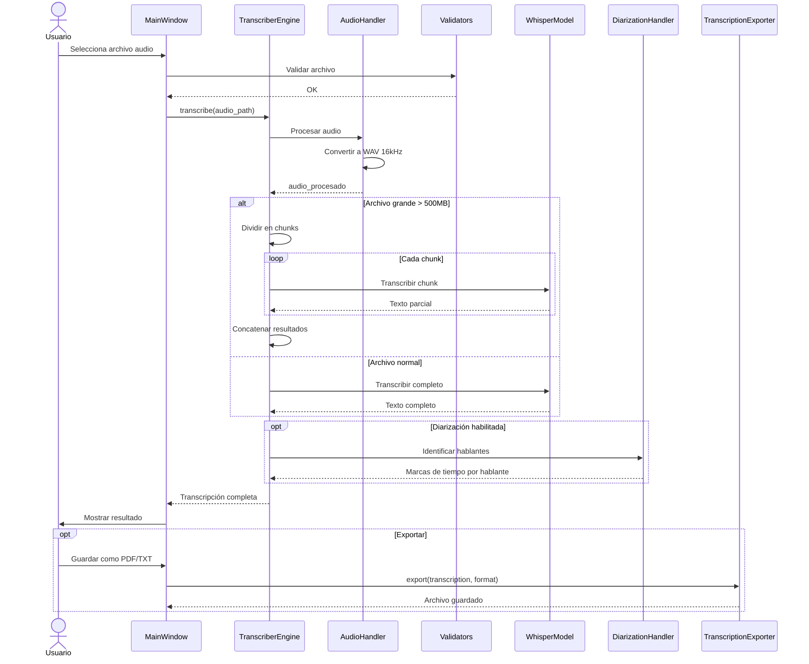
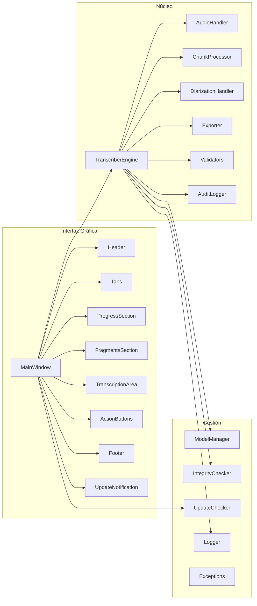
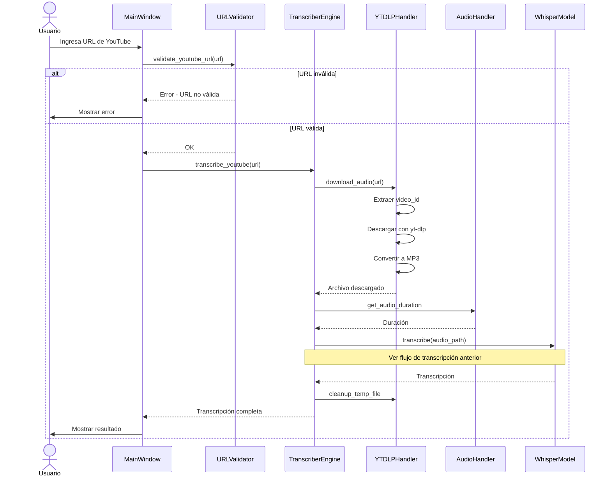
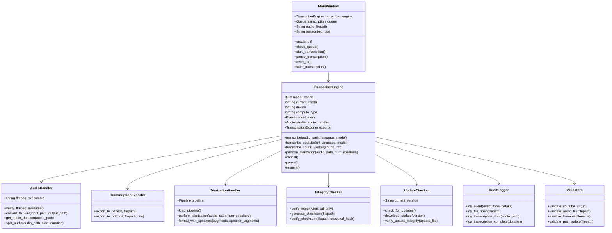
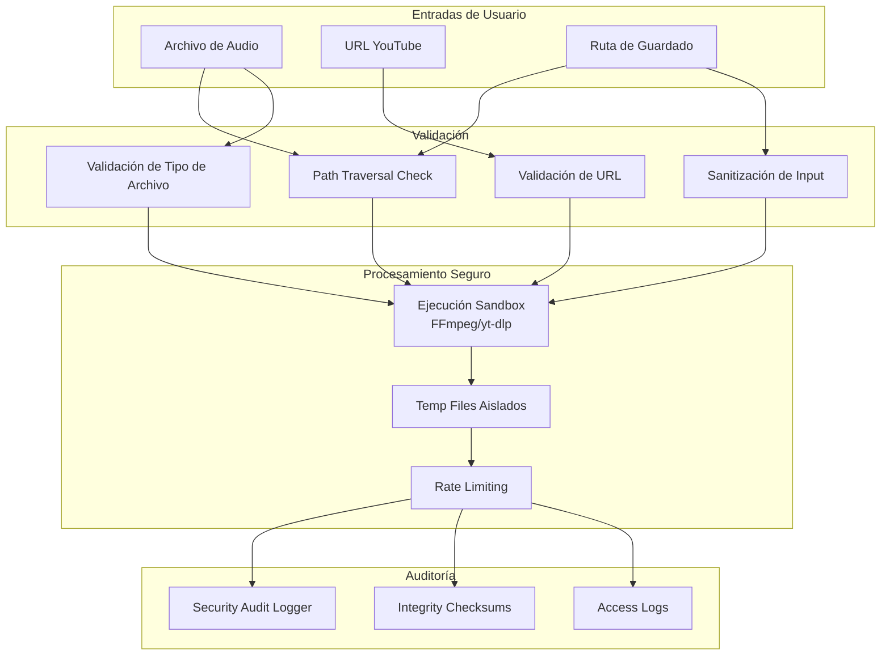
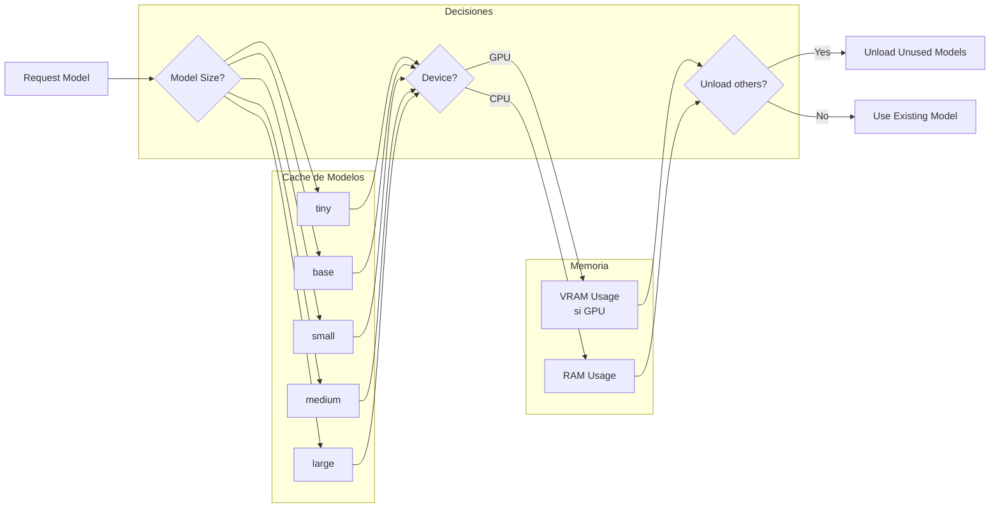

# Arquitectura de DesktopWhisperTranscriber

Este documento describe la arquitectura del sistema usando diagramas Mermaid.

## Tabla de Contenidos

1. [Vista General del Sistema](#vista-general-del-sistema)
2. [Flujo de Transcripción](#flujo-de-transcripción)
3. [Arquitectura de Componentes](#arquitectura-de-componentes)
4. [Secuencia de YouTube Download](#secuencia-de-youtube-download)
5. [Diagrama de Clases Principal](#diagrama-de-clases-principal)
6. [Flujo de Seguridad](#flujo-de-seguridad)

---

## Vista General del Sistema



---

## Flujo de Transcripción



---

## Arquitectura de Componentes



---

## Secuencia de YouTube Download



---

## Diagrama de Clases Principal



---

## Flujo de Seguridad



---

## Pipeline de Audio

```mermaid
graph LR
    A[Input Audio<br/>MP3/WAV/FLAC/etc] --> B{Formato}
    
    B -->|YouTube| C[yt-dlp<br/>Download]
    B -->|Local| D[Validación]
    
    C --> E[AudioHandler]
    D --> E
    
    E --> F[FFmpeg<br/>Convertir a WAV]
    F --> G[16kHz Mono<br/>PCM 16-bit]
    
    G --> H{Análisis de Tamaño}
    
    H -->|> 500MB| I[ChunkProcessor<br/>Dividir en segmentos]
    H -->|<= 500MB| J[Procesar completo]
    
    I --> K[Transcribir Chunks<br/>en Paralelo]
    J --> L[Transcribir Completo]
    
    K --> M[Concatenar Resultados]
    L --> N[Resultado Único]
    
    M --> O{Diarización?}
    N --> O
    
    O -->|Sí| P[pyannote.audio<br/>Identificar Hablantes]
    O -->|No| Q[Formatear Output]
    
    P --> Q
    
    Q --> R[Exportar<br/>TXT / PDF]
```



---

## Notas de Implementación

### Threading y Concurrency

```mermaid
graph TB
    subgraph "Main Thread"
        UI[GUI MainWindow]
        QUEUE[Queue Updates]
    end

    subgraph "Worker Threads"
        T1[Transcripción Thread]
        T2[YouTube Download Thread]
        T3[Diarización Thread]
    end

    subgraph "Process Pool"
        P1[Worker 1]
        P2[Worker 2]
        P3[Worker N]
    end

    UI -->|Inicia| T1
    UI -->|Inicia| T2
    T1 -->|Inicia| T3
    
    T1 -->|Submit chunks| P1
    T1 -->|Submit chunks| P2
    T1 -->|Submit chunks| P3
    
    P1 -->|Result| T1
    P2 -->|Result| T1
    P3 -->|Result| T1
    
    T1 -->|put| QUEUE
    T2 -->|put| QUEUE
    T3 -->|put| QUEUE
    
    QUEUE -->|after(100ms)| UI
```

### Gestión de Modelos



---

## Referencias

- [faster-whisper](https://github.com/SYSTRAN/faster-whisper)
- [pyannote.audio](https://github.com/pyannote/pyannote-audio)
- [CustomTkinter](https://github.com/TomSchimansky/CustomTkinter)
- [yt-dlp](https://github.com/yt-dlp/yt-dlp)

Para ver estos diagramas renderizados, usa extensiones de Mermaid en VS Code o visítalos en [Mermaid Live Editor](https://mermaid.live/).
